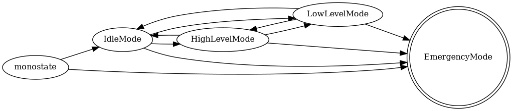

# Control Modes

## Modes

### std::monostate

A stand-in for a logically uninitialized control mode. The system holds this state only immediately after initialization, before any transition has been requested. The sdk wrapper has not been initialized yet in this mode.

### IdleMode

No commands are forwarded to the G1.

### HighLevelMode

High-level commands (via the LocoClient) can be forwarded to the G1. Control of the arms is possible via `rt/arm_sdk`.

### LowLevelMode

Direct motor gain and joint-level command control. Entered by releasing the `ai_sport` service through the MotionSwitcherClient. The G1 will go limp on entry.

### EmergencyMode

On entry, the system attempts to regain high-level control (if needed) and then enter damping mode. **Transitioning away from EmergencyMode is not allowed.**

## Transitions

### EmergencyMode transitions

Our modes don't truly reflect Unitree's internal controller state. This creates a hazard: we can transition from LowLevelMode to IdleMode and then attempt EmergencyMode without knowing whether the internal controller is in high-level or low-level mode. Damping mode is **not available** in low-level/debug/development mode — attempting it without high-level services active risks damage to the G1.

To handle this, transitions to EmergencyMode from IdleMode and LowLevelMode first ensure high-level services are active before calling `UnitreeSDKWrapper::damp()`. If `UnitreeSDKWrapper::damp()` fails, the system is still left in EmergencyMode with an error log indicating repeated estop calls may be needed.

### HighLevelMode entry

`MotionSwitcherClient::SelectMode("ai")` activates the `ai_sport` service. If not already active, upon re-enabling, the G1 enters zero torque mode (goes limp), similar to boot behavior.

### LowLevelMode entry

`MotionSwitcherClient::ReleaseMode()` turns off the `ai_sport` service and puts the G1 into debug mode. The G1 will lose control (go limp) on entry.

### Note

High-level services are active upon boot, meaning the system is implicitly in a state equivalent to HighLevelMode on startup (though we hold `std::monostate` until the first transition).
